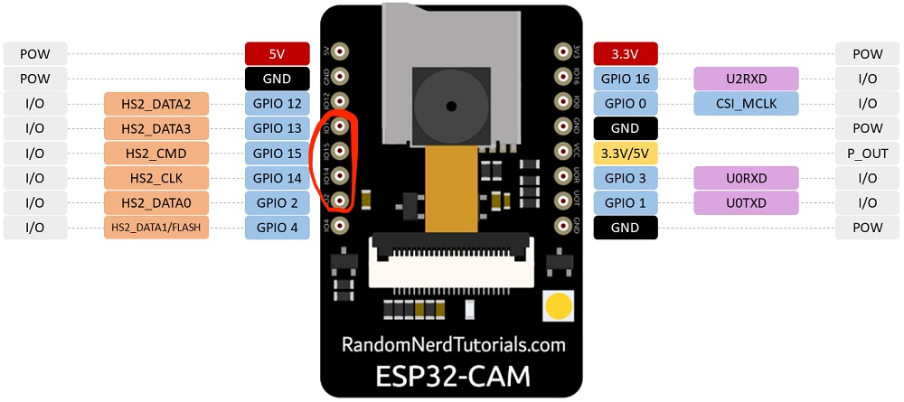

# Gruppe1-IoT

# Setup guide:

First plug out motor control pins. Note how they plug in, otherwise the motor controls may be backwards.

Before you upload the code, you need to setup the serial monitor in the arduino IDE, open it, set it to a baud rate of 115200.\
You also need to connect your pc to the same network as the arduino, and enter the network credentials into the code.\
Then upload code using arduino IDE.\
After the code is uploaded, go to the serial monitor in the arduino IDE, and you should see an ip address for the web server.\
Connect to the web server and verify that the camera is working, if it is, you can plug in the motor control pins, and provide power to the motors using the switch on the bottom of the car.\
